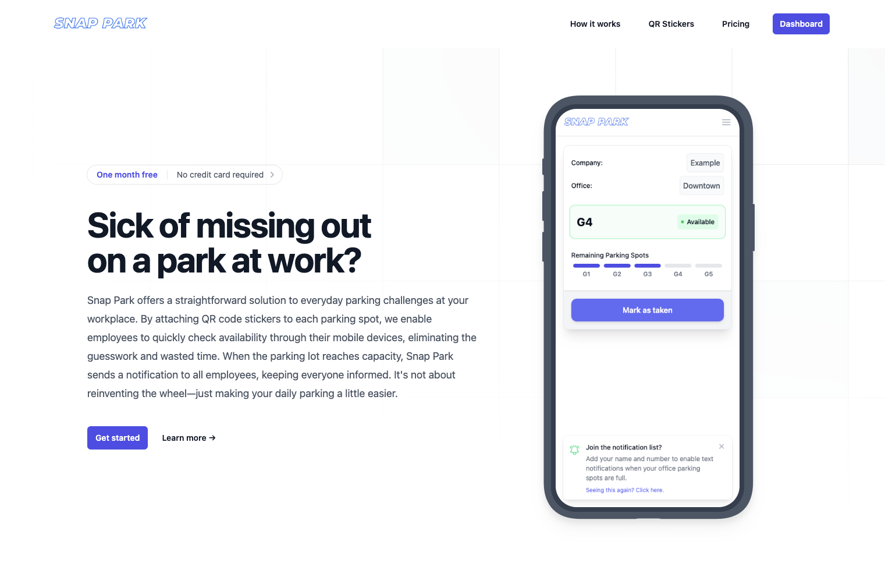
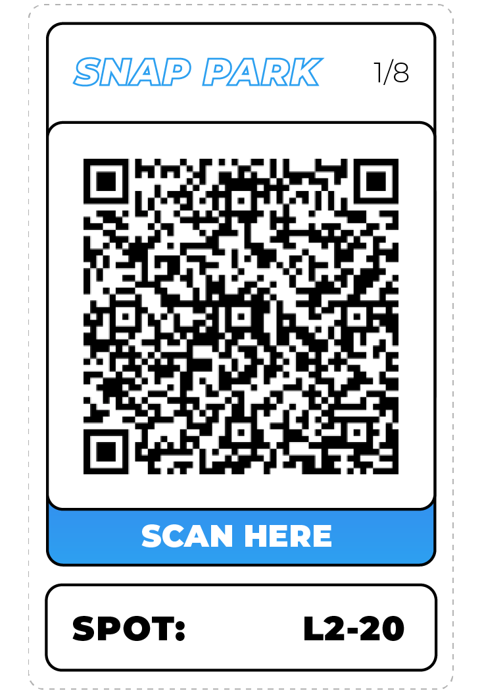
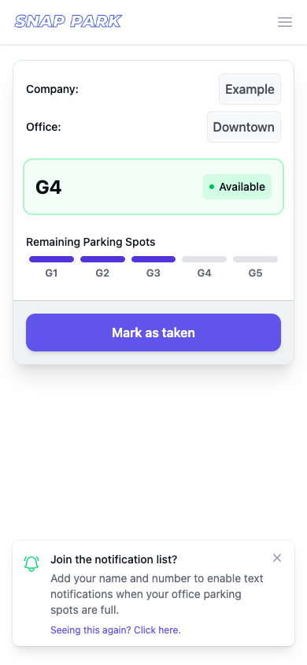
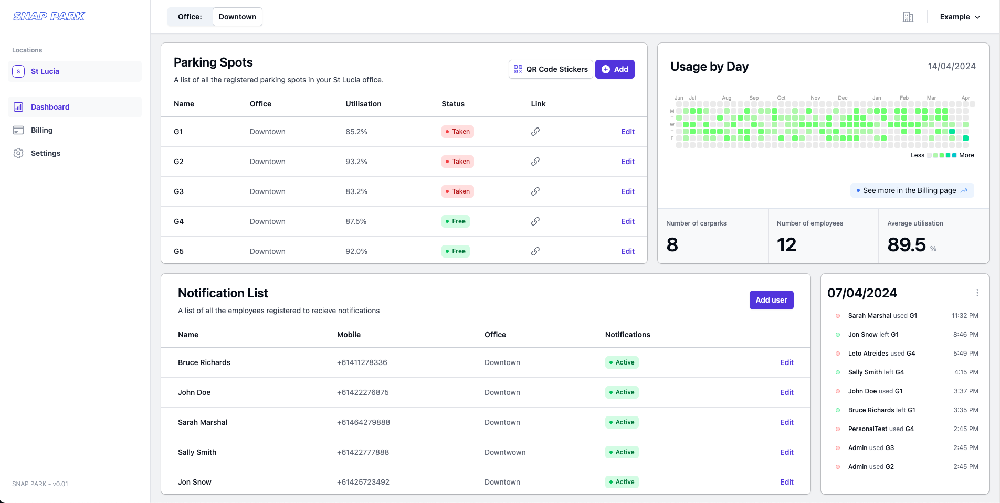
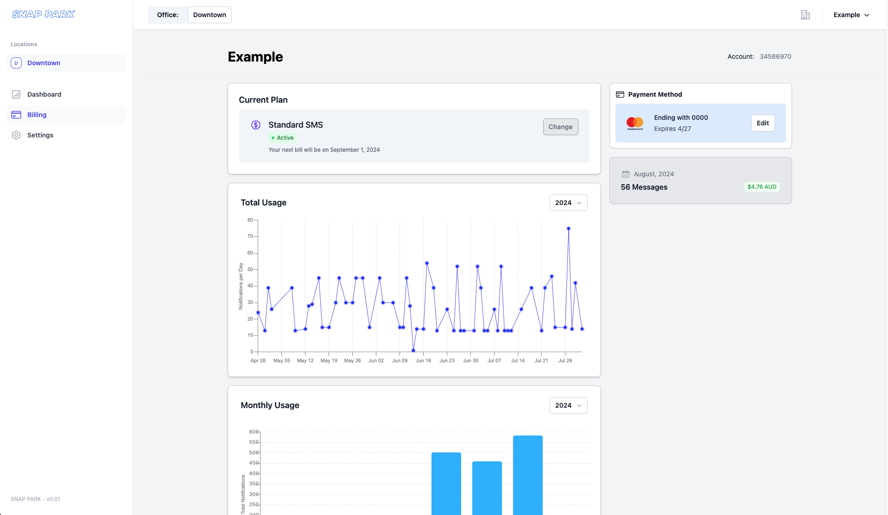
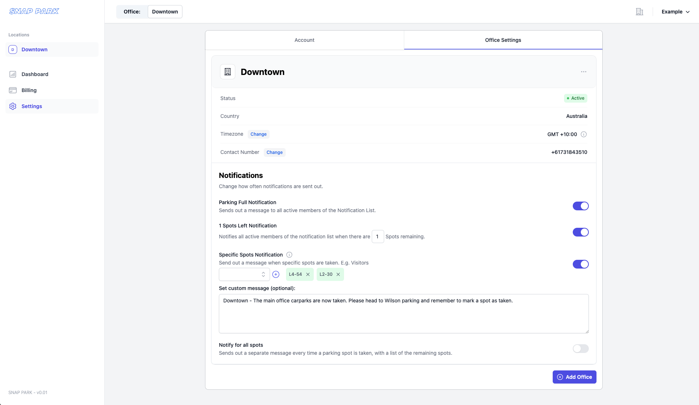

# Snap Park - Parking Management System

Visit the homepage at [snapark.co](https://snappark.co)

## Overview

Snap Park is a comprehensive parking management system designed to streamline and optimize parking spot allocation within companies. The system offers both a web application and a mobile app, allowing for easy management and notification of parking spots, along with advanced features such as QR code generation, usage tracking, and customizable notifications.

## Web Application

_An example of the Snap Park Homepage._

### Introduction

The Snap Park web application began as a simple proof of concept, initially deployed at my previous workplace. The core idea was to create an effective parking management system that could send notifications to employees regarding available parking spots. Despite the simplicity, the system proved highly valuable to my previous workplace, leading to its development into a full-fledged B2B service.

### How It Works

The idea was to make the system as simple to use for a companies employee's as possible. A unique QR code sticker is generated for each parking spot within an office building, which is then attached to a wall adjacent to the spot.

  

_An example of a Snap Park QR Code Sticker._

When an employee arrives at work and occupies a parking spot, they scan the QR code and mark it as taken. When all the car-parks are taken, an SMS is sent out to all employee's that have opted in letting them know they'll need to find street parking. This saves them the hassle of entering the parking lot and potentially driving up multiple levels before finding out all spots have already been taken. The current status of all the company's parking spots is available to the employee's in real-time via our web application.

_An example of a Snap Park Parking Spot Dash._

### Key Features

- **Dashboard Management**: Companies can manage parking spots, generate QR code stickers, and adjust notification lists through a user-friendly dashboard. Activity tracking is also available, allowing for detailed monitoring of parking spot usage.
- **Authentication and Billing**: The system includes integrated authentication and usage-based billing via Stripe, ensuring secure handling of sensitive company and employee data.
- **PDF Generation**: One of the challenges faced was generating PDFs with dynamic QR codes that could be printed reliably across different printers, each with unique margin settings. The solution provided a consistent layout that worked across various devices.

### Example Screenshots

- **Dashboard**

  

  _An example of the Snap Park Dashboard._

- **Billing Page**

  

  _An example of the Snap Park Billing page._

- **Settings Page**

  

  _An example of the Snap Park Settings page._

### Advanced Features

- **Notification System**: The system allows companies to fine-tune notifications, such as sending alerts when only one spot remains or when specific spots (e.g., visitor spots) are taken.
- **Security Enhancements**: Employee information, such as names and mobile numbers, is stored locally on their devices and sent alongside requests to mark spots as taken, ensuring accountability.

## Mobile Application

### Introduction

The Snap Park mobile app was developed to reduce the costs associated with sending SMS notifications. By shifting notifications to a mobile app, companies can significantly lower their overhead while maintaining the same level of functionality for their employees.

### Key Features

- **Cost Efficiency**: By using the mobile app, notifications can be sent essentially for free, reducing costs for both the application and the end user.
- **Streamlined UI/UX**: The mobile app mirrors the functionality of the web app but offers a more streamlined user experience tailored for mobile devices.
- **Authentication**: The app supports login and registration via Email & Password, Google, Apple, and Facebook, making it accessible to a broad range of users.

### Mobile App Demo

A screen recording of the App features can be seen in my portfolio: [tomcarruthers.com](https://tomcarruthers.com/projects/snappark)

### Development Challenges

- **App Store Approval**: Despite the mobile app being free for employees, the requirement to link accounts to a paying company has posed challenges in getting approval from the Apple App Store. Efforts are ongoing to resolve these issues and make the app available to a wider audience.

## Future Plans

The current system, while robust, is a foundation for a more extensive QR tracking system envisioned for the future. The early integration of advanced features ensures that Snap Park can scale and evolve as the needs of its users grow.

## Conclusion

Snap Park is a powerful tool for companies looking to manage their parking resources effectively. With both web and mobile applications, it offers flexibility, efficiency, and security, paving the way for a more organized and cost-effective approach to parking management.

For more details or to see the system in action, check out [Snap Park](https://snappark.co).

## License

This project is proprietary and not open source. All rights are reserved by SNAP PARK PTY LTD. Unauthorized copying, distribution, or modification of this software is strictly prohibited.

For more details, please refer to the [LICENSE](./LICENSE) file.

